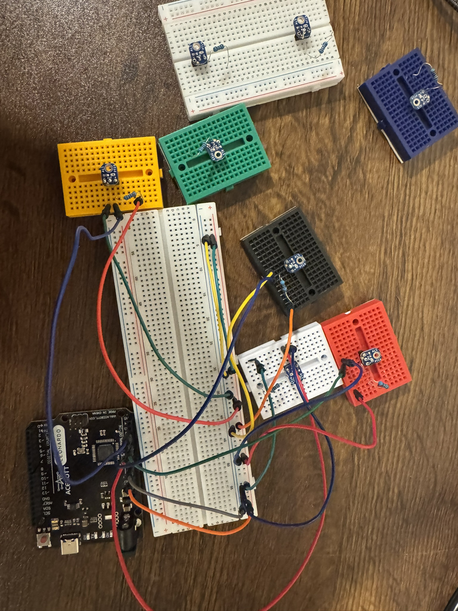

# Laser Piano
-----

### ***Components***

#### *Hardware*

* Arduino Leonardo (I used a generic one)

* Breadboard
* 5mW, 510 nm lasers
* ALS-PT19 Light sensors
* 10kΩ resistors
* Smoke machine (for visualizing the laser beams)

#### *Software*

* Aruduino IDE
* MIDI
* Dot Piano

_____

### ***How it works***

The laser shines onto a phototransisotr sensor. The sensor detects the amount of light and producese a voltage based on the light intensity.

The Ardunio reads this signal as a number and compares it to a threshold. When the laser beam is interrupted, the Ardunio detects the change and sends a MIDI message through USB.

The Ardunio does not send the actual audio. MIDI sends an instruction to the computer and tell it to play the note. The computer then uses a synthesizer to produce the sound.
For this project, I use Dot Piano to play the corresponding notes.

-----

### ***Building Process***

I started with a simple prototype using a button and a LED. When the button was pressed, the LED would turn on. This helped me understand the basic idea of taking an input and using it to creat an output.

I then replaced the button with the laser and phototransistor system. The phototransistor allowed the Ardunio to detect the changes in light. The Arduino reads the phototransistor's signal and converts it into a number.

 I tested the sensor readings and used a threshold to determine when a laser beam had been broken. The sensor readings were generally in the range of about 100–600, depending on the amount of light reaching the sensor. The Arduino uses a threshold to determine whether the laser beam is being detected or has been interrupted.

 After getting the sensors working, I connected the Ardunio to MIDI so that breaking each laser beam could trigger a different note.

----

## ***Final Product***

